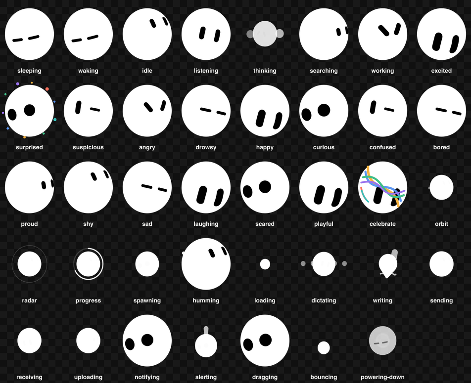
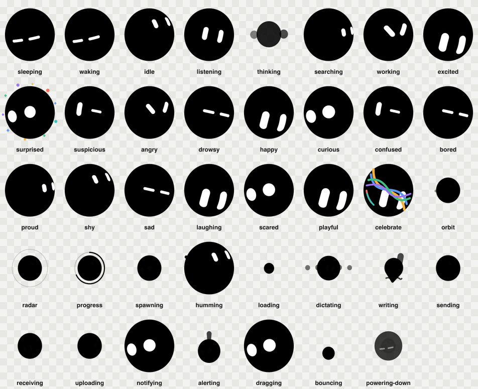

# Grok Bot for Codex

### Make your Codex workspace feel a little more alive.

An expressive, unofficial desktop pet that reacts while Codex works—looking
around, focusing with the task, asking for attention, recovering from blocked
work, and celebrating when something is ready for you.


## Install or update in one line

Choose the edition that contrasts with your Codex theme. There is nothing to
clone and no build step.

**Dark Codex — white Grok Bot**

```sh
curl -fsSL --proto '=https' --tlsv1.2 https://raw.githubusercontent.com/heyNag/codex-pet-grok-bot/main/install.sh | sh -s -- dark
```

**Light Codex — black Grok Bot**

```sh
curl -fsSL --proto '=https' --tlsv1.2 https://raw.githubusercontent.com/heyNag/codex-pet-grok-bot/main/install.sh | sh -s -- light
```

Want both editions? Install them together:

```sh
curl -fsSL --proto '=https' --tlsv1.2 https://raw.githubusercontent.com/heyNag/codex-pet-grok-bot/main/install.sh | sh -s -- both
```

When it finishes, open **Settings > Pets**, select **Refresh**, choose your
Grok Bot, and enter `/pet` to wake it.

The same command is also the update command. Rerun it after a new release; an
already-current pet is recognized or registered in place without replacing its
pet files, and every update keeps the same exact pet ID instead of creating a
duplicate. A failed update restores the prior pet. The installer refuses
unknown or locally modified folders rather than overwriting them.

To remove both installer-managed editions later:

```sh
curl -fsSL --proto '=https' --tlsv1.2 https://raw.githubusercontent.com/heyNag/codex-pet-grok-bot/main/install.sh | sh -s -- remove both
```

Replace `both` with `dark` or `light` to remove one edition. Locally
modified or unmanaged folders are left untouched.

Prefer to inspect everything first? [Review the installer](install.sh) or use
the [optional manual installation flow](docs/INSTALL.md). The complete guide
also explains update safety and recovery.

## Built to feel alive

This is more than a mascot sitting in the corner. Grok Bot acts through its
eyes and its whole body, tracks supported workspace targets, and makes the
state of a task feel instantly visible. Two ready-to-install editions stay
unmistakable on either Codex surface, and their separate IDs mean you can
install both at once.

- **Reacts to the work.** Nine authored behaviors cover idle, movement,
  greeting, jumping, blocked work, waiting for you, active work, and the moment
  a task is ready for review.
- **Looks back at you.** Sixteen gaze directions let the pet follow supported
  caret and cursor targets instead of staring through the workspace.
- **Moves as one living character.** Fluid eye morphs, squash, stretch, lean,
  attached gestures, and celebration color give every behavior a distinct read
  without breaking the familiar silhouette.
- **Keeps one recognizable personality.** The familiar blob silhouette stays
  consistent while 73 runtime-addressable cells and a fluid motion layer give
  it a surprisingly broad emotional range.
- **Has even more to explore.** The included Character Lab preserves a broader
  39-state expression library and 14 effect studies beyond the smaller set of
  behaviors Codex can trigger directly.

## Choose your Grok Bot

| | Grok Bot Dark | Grok Bot Light |
| --- | --- | --- |
| Best on | Dark Codex surfaces | Light Codex surfaces |
| Character | White body, black eyes | Black body, white eyes |
| Pet ID | `grok-bot-dark` | `grok-bot-light` |
| Ready bundle | [`pet/grok-bot-dark/`](pet/grok-bot-dark/) | [`pet/grok-bot-light/`](pet/grok-bot-light/) |

Both editions can remain installed at the same time. Switch pets when you
switch themes; installing or updating one does not replace the other.

## Preview the full personality

Want to meet both editions before installing them? With Node.js 22 or newer:

```sh
npm run preview
```

Open [http://127.0.0.1:4173](http://127.0.0.1:4173). The local animation lab
starts in a side-by-side comparison mode with synchronized controls for every
desktop behavior, all 16 gaze directions, the complete expression library,
and every effect study. It opens at the recommended display size with
crisp, host-faithful rendering, plus inspection controls for a closer look.
Previewing does not install a pet or change Codex settings. Press
<kbd>Control</kbd> + <kbd>C</kbd> when you are finished.

For the full review checklist, see [Local testing](docs/LOCAL-TESTING.md).

## A wider expression range

The installed pets turn a rich character vocabulary into short, readable Codex
performances. The Character Lab keeps the complete design range visible without
pretending every expression is a separate host event.

| For dark Codex surfaces | For light Codex surfaces |
| :--: | :--: |
|  |  |

Explore the [state choreography](docs/STATE-MAP.md),
[character and motion design](docs/DESIGN.md), or the complete
[character reference specification](docs/CHARACTER-SPEC.md).

## Built with care

Both editions are authored and reviewed as one character system, keeping their
silhouette, timing, expressions, and movement matched across themes. The full
development and release review lives in the technical documentation.

### Use and preview

- [Install, update, and select both pets](docs/INSTALL.md)
- [Preview and test locally](docs/LOCAL-TESTING.md)

### Design and format

- [Character and motion design](docs/DESIGN.md)
- [Expression and behavior mapping](docs/STATE-MAP.md)
- [Palette and theme system](docs/COLOR-SYSTEM.md)
- [Codex pet format contract](docs/FORMAT.md)
- [Codex pet runtime behavior and engineering notes](docs/CODEX-PET-RUNTIME.md)
- [Complete character specification](docs/CHARACTER-SPEC.md)

### Contribute and verify

- [Development and release-quality verification](docs/DEVELOPMENT.md)
- [Copyright, trademark, and redistribution notice](NOTICE.md)

OpenAI's [Pets documentation](https://learn.chatgpt.com/docs/pets) describes the
desktop feature used by this project.

## Unofficial project

This is an independent, unofficial project. It is not affiliated with or
endorsed by xAI or OpenAI. Product names identify the pet and compatibility
target only. See [NOTICE.md](NOTICE.md) before redistributing the repository or
its generated artwork.
