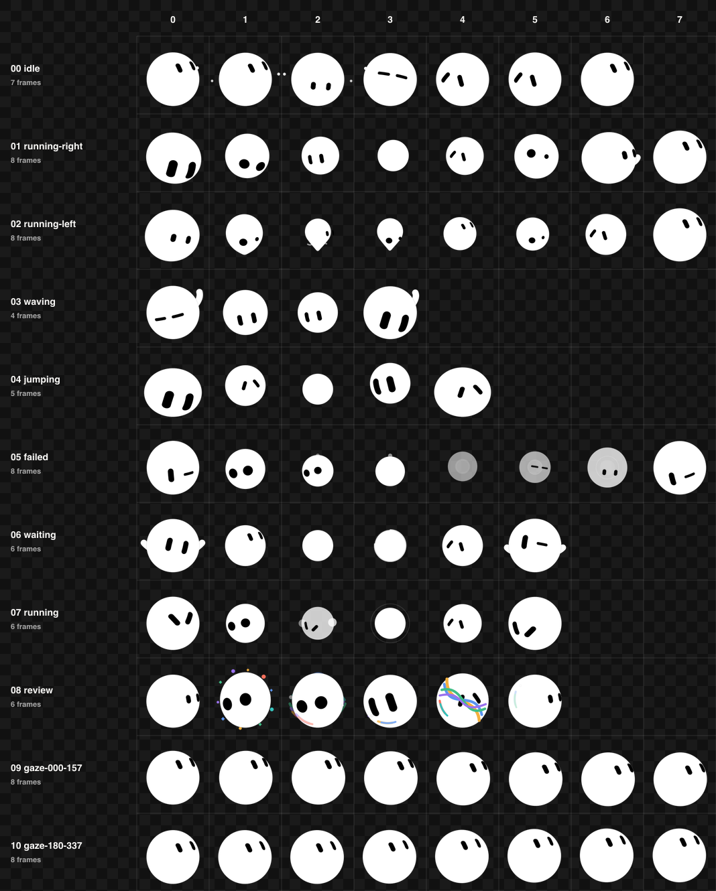

# Grok Bot for Codex

An expressive, unofficial Grok Bot adaptation for the local Codex desktop
custom-pet v2 format. The project ships two deterministic static atlases—one
for dark Codex surfaces and one for light surfaces—with 74 populated frames
across nine timed behavior rows and a 16-direction pointer-gaze field.



The character model combines one persistent blob silhouette, 25 eye
topologies, 18 optional body shapes, 14 effect modes, and a 39-state expression
vocabulary. The Codex adaptation maps that range into deterministic rows that
remain readable at desktop-pet scale. Geometry, motion equations, and format
limits are documented in the
[character reference specification](docs/CHARACTER-SPEC.md).

## Build and inspect

```sh
npm ci
npm run build
npm test
npm run validate
npm run qa
npm run preview
```

The preview is an interactive animation lab. It exposes each installed Codex
behavior, plays the desktop host cadence, shows the grid and gaze field, and
provides a separate expression lab for all 39 states, all 14 effect morphs at
four activation landmarks, and lossless 60 fps onset/sustain/release studies.
It opens with the dark and light variants side by side on one synchronized
controller; either variant can also be focused on its own. The preview runs
through the repository's built-in `npm` script. Building and previewing do not
install a pet into Codex.

`npm run qa` is the ordinary final verification command. It rebuilds the local
artifacts, validates both bundles, checks exact theme parity, regenerates the
runtime-faithful lossless previews, runs the negative tests, and verifies the
committed evidence seal. It does not rewrite that seal.

## Release-quality evidence workflow

The evidence under [`qa/`](qa/) is intentionally review-sensitive. A final art
change requires all deterministic outputs to be regenerated, followed by the
official hatch-pet validation/contact/direction/GIF tools, five independent
blind direction reviews, and an original-detail visual review of both themes,
all runtime rows, all 39 character states, and all 14 effects. The local
`npm run qa:official` command is a portable, read-only recheck of the resulting
seal against the current atlas cells, PNG pixels, GIF timing tables, continuity
reports, and eight pinned official-tool hashes. It neither requires the
official tools to be installed nor rewrites the seal.

If a maintainer has genuinely regenerated the official artifacts with the
audited hatch-pet tools, the explicit local reseal is:

```sh
HATCH_PET_SCRIPTS_ROOT=/absolute/path/to/hatch-pet/scripts \
  npm run qa:official -- --seal
```

The path defaults to the bundled ChatGPT macOS hatch-pet scripts when the
environment variable is omitted. Resealing refuses any tool whose bytes do not
match the eight independently pinned hashes.

The lossless motion studies are also review-sensitive, not an ordinary build
product. Regenerate them only with the repository's pinned Node `v26.8.1`,
Sharp `0.35.4`, libvips `8.18.6`, and WebP `1.6.0` stack:

```sh
npm run build:source-motion
```

The generator checks that full encoder tuple before deleting or writing any
motion artifact. The broader `node >=22` package engine remains valid for the
ordinary pet build, preview, validation, and tests.

Only after those reviews genuinely pass should a maintainer run:

```sh
npm run qa:seal
npm run qa
```

Do not use `qa:seal` merely to silence changed hashes: it records the reviewed
artifacts, independent direction verdicts, motion-study metadata, and final
human/agent visual attestation. CI rebuilds only the code-native shipping
atlases; font-bearing contact sheets are audited, committed evidence rather
than a cross-platform byte-reproducibility claim.

## Generated bundles

| Surface | Manifest ID | Repository bundle | Contact sheet |
| --- | --- | --- | --- |
| Dark | `grok-bot-dark` | [`pet/grok-bot-dark/`](pet/grok-bot-dark/) | [dark contact sheet](preview/contact-sheet.png) |
| Light | `grok-bot-light` | [`pet/grok-bot-light/`](pet/grok-bot-light/) | [light contact sheet](preview/contact-sheet-light.png) |

Each folder contains its own [`pet.json`](pet/grok-bot-dark/pet.json) and
`spritesheet.webp`. A static WebP cannot inspect the terminal theme, so the two
IDs are intentional: the dark-surface pet is white with black eyes; the
light-surface pet is black with white eyes. See
[the color system](docs/COLOR-SYSTEM.md) for the exact palette.

## What is included

- A static Codex v2 atlas: `1536 × 2288`, 8 columns × 11 rows, with
  `192 × 208` transparent cells.
- 88 total cells: 74 populated frames and 14 required transparent cells.
- Nine behavior rows: idle, travel right, travel left, wave, jump, failed,
  waiting, active work, and ready for review.
- Sixteen gaze cells in exact 22.5° clockwise steps from up.
- A 25-pose eye dataset and all 39 state eye/pose/blink timing maps, adapted to
  the smaller Codex host vocabulary.
- A non-installable expression lab with a 39-state inspection atlas and 14
  effect transition rows sampled at activation `A = 0.25, 0.50, 0.62, 0.90`.
- Dark/light animated WebP studies for all 14 effects, sampled at 60 fps through
  exact spring onset, a sustained phase, and spring release.
- Deterministic code-native vector generation and strict geometry, alpha,
  manifest, direction, file-size, and runtime-continuity validation. Runtime
  validation enforces release thresholds across all 65 unique transitions per
  theme, including alpha, composited-color, changed-area, silhouette-area, and
  exact dark/light alpha-geometry parity limits.

The canonical character body is always the default `blob`. The 18 registered
body shapes are avatar-level customization choices—not a pool to randomize
across emotion frames. Acting comes from squash, stretch, lean, eye topology,
gaze, and attached effects while the pet's identity stays persistent.

All 14 auxiliary effects deform the body; `ball` and `whirl` are not exceptions
or detached props. `orbit` uses five monochrome body-color dots, while the
separate `humming` choreography uses two opposed satellites for an ambient idle
read. High-energy completion adds layered rainbow ribbons in front of and
behind the body.

The shipping atlas and expression lab have different jobs. The installed rows
are coherent actions that survive Codex's fixed repeat and handoff behavior.
The expression lab preserves the broader design catalog without pretending the
host can address 39 Grok states or 14 effect modes independently.

## Install in Codex Pets

The two ready bundles live at [`pet/grok-bot-dark/`](pet/grok-bot-dark/) and
[`pet/grok-bot-light/`](pet/grok-bot-light/). To add them, open
**Settings > Pets > Create your own pet** in the ChatGPT desktop app and ask the
new chat to install both existing bundle folders while preserving their manifest
IDs. When it finishes, return to **Settings > Pets**, select **Refresh**, choose
**Grok Bot Dark** or **Grok Bot Light**, and enter `/pet` to wake it.

The two bundle names are also the runtime identity boundary:
`custom:grok-bot-dark` and `custom:grok-bot-light`. Installing one therefore
does not replace the other. The full copy-paste prompt, safety checks, CLI usage,
and update procedure are in [Install in Codex Pets](docs/INSTALL.md).

The repository intentionally ships no command that writes to `CODEX_HOME`.
Build, preview, validation, and QA remain read-only with respect to Codex
settings and pet directories; installation is a separate action you approve in
the app.

## Animation contract at a glance

| Atlas row | Codex behavior | Populated frames | Frame durations (ms) |
| ---: | --- | ---: | --- |
| 0 | Idle | 7 | `280 110 110 140 140 320` for c0–c5; c6 is neutral/rest |
| 1 | Travel right | 8 | `120 120 120 120 120 120 120 220` |
| 2 | Travel left | 8 | `120 120 120 120 120 120 120 220` |
| 3 | Wave | 4 | `140 140 140 280` |
| 4 | Jump | 5 | `140 140 140 140 280` |
| 5 | Failed / blocked | 8 | `140 140 140 140 140 140 140 240` |
| 6 | Waiting for input | 6 | `150 150 150 150 150 260` |
| 7 | Active work | 6 | `120 120 120 120 120 220` |
| 8 | Ready for review | 6 | `150 150 150 150 150 280` |
| 9–10 | Pointer gaze | 16 | Direct selection by angle |

The duration table is the raw atlas cadence, not the whole runtime contract.
In the Codex desktop runtime, idle c0–c5 is slowed by `6×`, making the
raw `1.10 s` sequence a `6.60 s` loop. A non-idle row plays three complete
cycles and then hands off to idle c0. Idle c6 is a populated host-selected
neutral-look frame and is not part of the timed idle cycle. Pointer gaze snaps
to the nearest one of 16 cells rather than interpolating.

The static atlas has one authored timing choreography. By explicit owner
choice, it has no custom reduced-motion atlas or code path. Codex itself can
still freeze the pet on c0 when the host reduced-motion setting requires it;
the pet manifest has no opt-out switch.

This repository targets the **local desktop** `1536 × 2288` v2 atlas.

## Documentation

- [Portable local testing and desktop pet verification](docs/LOCAL-TESTING.md)
- [Install both Grok Bot variants in Codex Pets](docs/INSTALL.md)
- [Codex atlas and manifest format](docs/FORMAT.md)
- [Complete 39-state mapping and timing model](docs/STATE-MAP.md)
- [Character and motion design](docs/DESIGN.md)
- [Palette and theme variants](docs/COLOR-SYSTEM.md)
- [Character reference specification](docs/CHARACTER-SPEC.md)
- [Copyright, trademark, and redistribution notice](NOTICE.md)

OpenAI's current [Pets documentation](https://learn.chatgpt.com/docs/pets)
describes the desktop feature this package targets.

## Project status and rights

This is an independent, unofficial adaptation. It is not an official Grok Bot,
Anysphere, Cursor, xAI, SpaceX, OpenAI, or Codex release. Product names are used
only to identify the character inspiration and compatibility target. No
ownership of, or license to, third-party code, artwork, audiovisual material,
names, logos, or trademarks is asserted. Review copyright, trademark,
third-party, and service terms before redistributing the repository or its
generated atlases; see [NOTICE.md](NOTICE.md).
